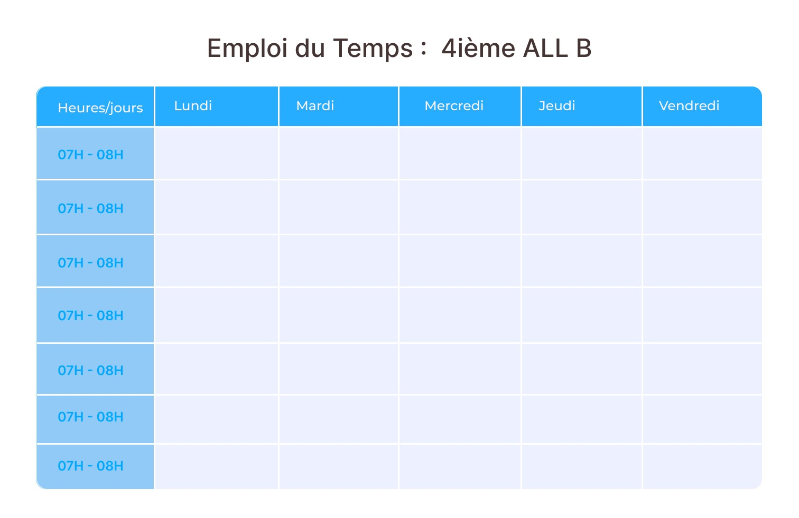

# Correction du design du tableau
Ce repository renferme l'implementation du design du tableau realiser la derniere fois

### Image d'illustration

1. couleur primaire : #00A9FF
2. couleur secondaire: #89CFF3 
3. couleur tertiare: #A0E9FF

# Notes : 
### 13/20